## Firefox Marketplace の
## アプリを色々調べてみました

---
#### 自己紹介
<h2>ひらとり</h2>


<h3>(@flatbirdH)</h3>

- Firefox OS コミュニティ
- html5j Webプラットフォーム部

---
#### 前々回 LT しました

#### 関東 Firefox OS 勉強会 5th
##### (2013/11/26)

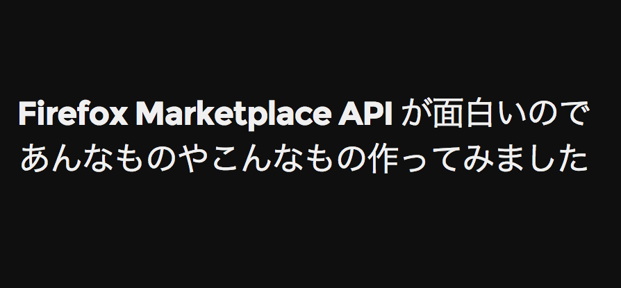
##### <http://flatbird.github.io/LT-fxos-marketplace/>

---
#### 前々回 LT
### Firefox Marketplace API 紹介

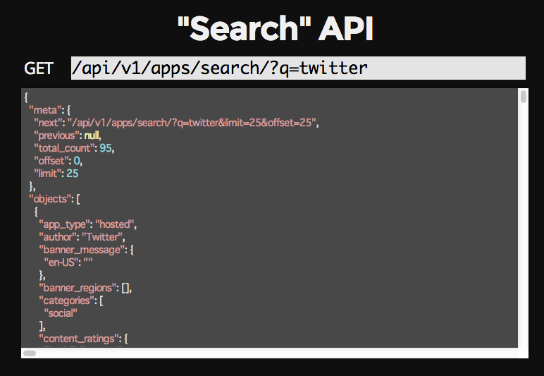

---
#### 前々回 LT
### こんなの作りました…という話

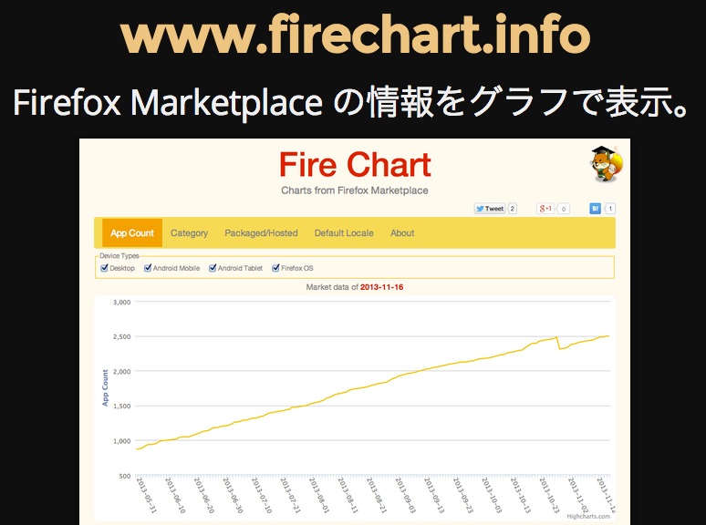

---
## 今回は、
## 続編みたいな感じ

---
## アプリは
## どれだけ増えてる？

---
### 1 年で
## 1,209 個→4,287 個へ
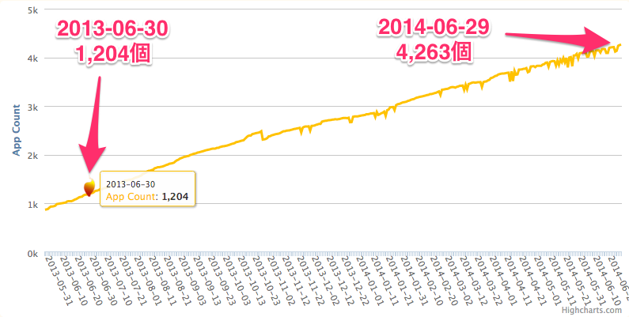

---
## まだまだ少ない？

---
#### 少し前の記事
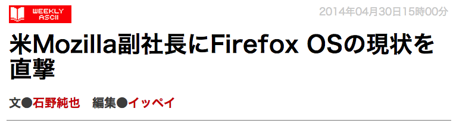<!-- .element: style="width: 100%" -->

##### <http://weekly.ascii.jp/elem/000/000/217/217854/>

---
### 「Firefox OSデバイス向けのアプリで、マーケットプレイスの中にあるものはそれほど多くない」<!-- .element: class="fragment" data-fragment-index="1" -->

<br>
### 「人気があるのは“ホスティッド”で、全体の90％程度」<!-- .element: class="fragment" data-fragment-index="2" -->

---
#### マーケットプレースではパッケージ型が５割強

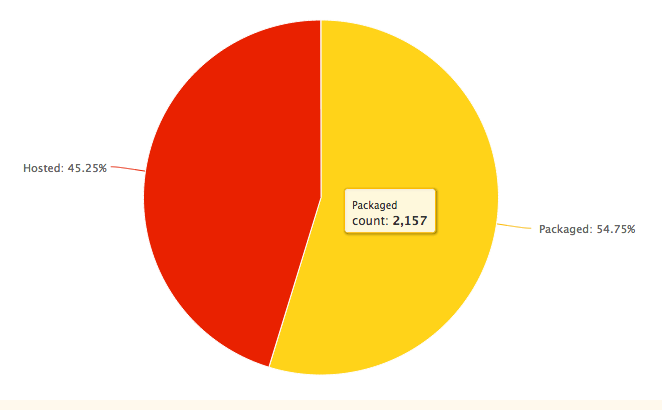<!-- .element: style="width:100%" -->

---
### 思いのほか「野良アプリ」が多い？
### 実際のアプリ数は？<!-- .element: class="fragment" -->

---
### ホスト型が 90% で、
<h3 style="margin-bottom: 30px" class="fragment">
	マーケットのパッケージ型アプリ
	<span class="strong red">2172</span> 個
	<span class="small">(2014/7/1)</span>
</h3>
<h3 style="margin-bottom: 30px" class="fragment">
	これが 10 % なら全体は<span class="strong red">２万以上！</span>
</h3>

---
## Firefox OS アプリは
## 見かけより多い！

---
## とはいっても、、、

---
### 日本語アプリ少ない！

#### Total: 4288 (2014/07/01)

<table id="locale-table">
<thead>
<tr>
<th>#</th>
<th>locale</th>
<th>count</th>
<th>%</th>
<th>#</th>
<th>locale</th>
<th>count</th>
<th>%</th>
</tr>
</thead>
<tbody>
<tr>
<td>1</td>
<td>en-US</td>
<td>3528</td>
<td>82.2%</td>
<td>11</td>
<td>el</td>
<td>63</td>
<td>1.4%</td>
</tr>
<tr>
<td>2</td>
<td>es</td>
<td>906</td>
<td>21.1%</td>
<td>12</td>
<td>nl</td>
<td>50</td>
<td>1.1%</td>
</tr>
<tr>
<td>3</td>
<td>pt-BR</td>
<td>295</td>
<td>6.8%</td>
<td>13</td>
<td>zh-CN</td>
<td>42</td>
<td>0.9%</td>
</tr>
<tr>
<td>4</td>
<td>de</td>
<td>254</td>
<td>5.9%</td>
<td>14</td>
<td>ja</td>
<td>38</td>
<td>0.8%</td>
</tr>
<tr>
<td>5</td>
<td>fr</td>
<td>231</td>
<td>5.3%</td>
<td>15</td>
<td>zh-TW</td>
<td>36</td>
<td>0.8%</td>
</tr>
<tr>
<td>6</td>
<td>pt-PT</td>
<td>202</td>
<td>4.7%</td>
<td>16</td>
<td>cs</td>
<td>29</td>
<td>0.6%</td>
</tr>
<tr>
<td>7</td>
<td>it</td>
<td>201</td>
<td>4.6%</td>
<td>17</td>
<td>ar</td>
<td>25</td>
<td>0.5%</td>
</tr>
<tr>
<td>8</td>
<td>pl</td>
<td>201</td>
<td>4.6%</td>
<td>18</td>
<td>ro</td>
<td>25</td>
<td>0.5%</td>
</tr>
<tr>
<td>9</td>
<td>hu</td>
<td>101</td>
<td>2.3%</td>
<td>19</td>
<td>ca</td>
<td>24</td>
<td>0.5%</td>
</tr>
<tr>
<td>10</td>
<td>ru</td>
<td>75</td>
<td>1.7%</td>
<td>20</td>
<td>tr</td>
<td>22</td>
<td>0.5%</td>
</tr>
</tbody>
</table>

---

## 誰か、もっと作って！

<ul>
<li class="fragment" data-fragment-index="1"><h3>でも、端末出てないし、、、</h3></li>
<li class="fragment" data-fragment-index="2"><h3>市場シェアが、、、</h3></li>
<li class="fragment" data-fragment-index="3"><h3>アプリ出してもなー</h3></li>
</ul>

---
## ジレンマ
### 市場がなければアプリは増えない
### アプリがなければ市場シェア増えない

---
## そこで・・・

---


### Cordova 君 <!-- .element: class="fragment nomargin" -->

---
### Cordova (PhoneGap)
- 2014年2月、Cordova 3.4 から Firefox OS サポート
- クロスプラットフォームで、Android, iOS さらに Windows Phone も！
- アプリストアに置ける
- パッケージ型 (=オフライン) アプリ

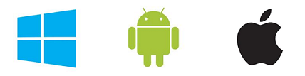 <!-- .element: style="width:80%;" -->

---
### Cordova なら
### Firefox OS アプリで
### 大きな市場 (Android/iOS) を
### 一緒に狙えるかも!

---
### 実は、マーケットプレースには、
<h3 class="fragment" data-fragment-index="1">既に <span style="color:red">60 個</span>以上の Cordova アプリが！</h3>
#### (2014/07/01 で 67 個) <!-- .element: class="fragment" data-fragment-index="1" -->

---
## Cordova Firefox OS 
## アプリ紹介

---
### Webchemy

#####<https://marketplace.firefox.com/app/webchemy-1>


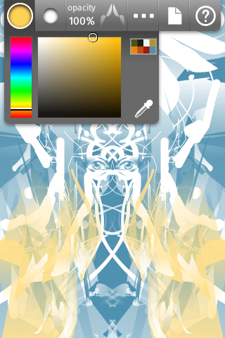

##### Firefox OS, Android, (Chrome Apps)

---
### MoeDict (萌典)

##### <https://marketplace.firefox.com/app/%E8%90%8C%E5%85%B8> 

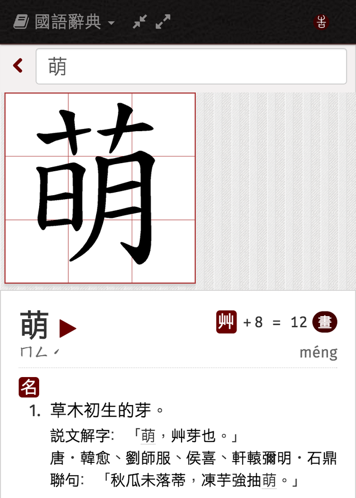

##### Firefox OS, Android, iOS
#### 「萌」から始まる中国語 (台湾語) 辞典。

---


#### MoeDict のアイコン

---

### electo

##### <https://marketplace.firefox.com/app/electo>

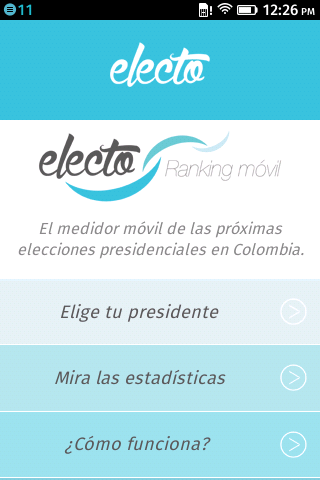


##### Firefox OS, Android, iOS
#### 南米、コロンビアの大統領選アプリ

---
### electo アプリ紹介文より

##### <!-- .element: class="nomargin" -->原文 (スペイン語)
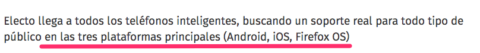

##### <!-- .element: class="nomargin" -->英語
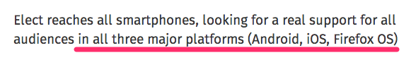

---
## コロンビアの
## ３大メジャースマホは
<h2>Android, iOS, <span style="color:red">Firefox OS</span>！</h2>

---
### 実はパッケージ型アプリの大半は
### Cordova でも大丈夫？

---
#### パッケージ型でも
<h2>86.8% <span style="font-size:.4em">(2172個/2500個)は</span></h2>
### 特権 (privileged) なし

- Firefox OS 固有の Web API ほとんど使ってない<!-- .element: class="fragment" -->
- 簡単に Cordova に移行できるんじゃ？<!-- .element: class="fragment" -->

---
### Firefox OS アプリを作る際は、
### Cordova も検討するといいかも

---
### 私もやってみました！

---
### Cordova Firefox OS 体験談

---
### ＜作ったもの＞
### アドレス帳移行アプリのプロトタイプ

---
### スタイルを素で組むの面倒！
- ヘッダとかフッタとかメニューとか、、、
- スマホアプリっぽい見た目をサクっと用意したい。
- ネイティブ開発なら何もしなくても付いてくるのに。。。

---
### モバイル UI フレームワークを
### 使おう！

---
## jQuery Mobile,
## Sencha Touch, Kendo UI,<!-- .element: class="fragment" -->
## TopCoat, App Framework,<!-- .element: class="fragment" -->
## Onsen UI, Ionic...<!-- .element: class="fragment" -->
<br>
### どれがいいの？？？<!-- .element: class="fragment" -->

---
### Kendo UI を選ぶ


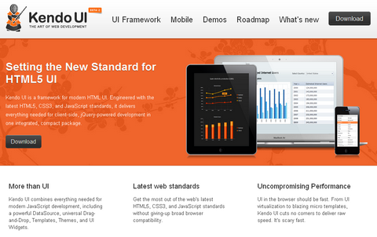<!-- .element: class="nomargin" style="width:60%" -->

##### <!-- .element: class="nomargin" --><http://www.telerik.com/kendo-ui>

- 多機能なモバイル UI フレームワーク
- テンプレート、データバインディングも
- ４月からオープンソース化

---
### これが不幸を呼ぶ。。。

---
### 大体動く所まで来た・・・
1. ブラウザ (ripple) で開発<!-- .element: class="fragment" -->
2. Android で動作確認<!-- .element: class="fragment" -->
3. iOS で動作確認<!-- .element: class="fragment" -->
4. Firefox OS で動作確認・・・<!-- .element: class="fragment" -->

---
### あれ？
- コンタクトリスト取れない？
- あ、マニフェストに `"type": "privileged"` ついてなかった。
- permission も設定して、Firefox OS で再確認。

---
## 真っ白。。。

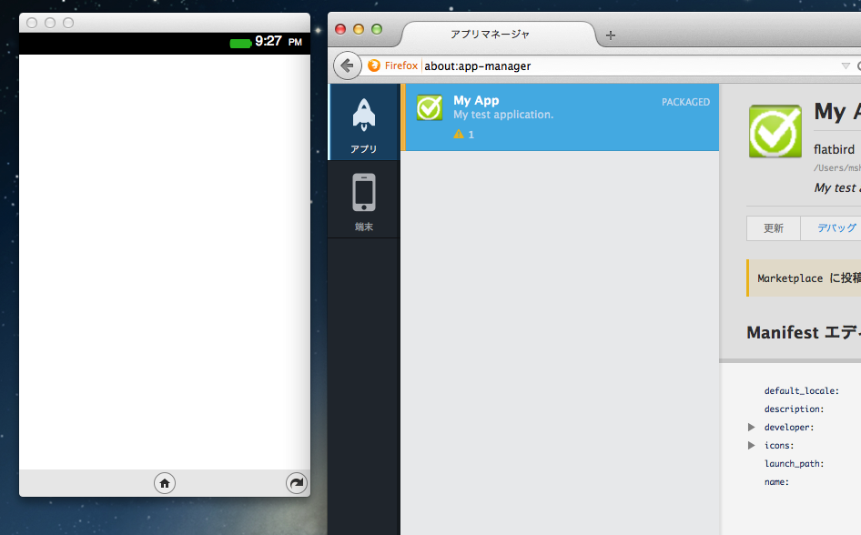

---
## 原因は CSP 違反

---
### CSP: Content Security Policy
- クロスサイトスクリプティング対策
- 外部リソースの制限や eval の禁止等
- 特権・認定アプリに強制的に付いてくる

<br>
#### [CSP (Content Security Policy) - Security | MDN](https://developer.mozilla.org/ja/docs/Security/CSP)

---
### 引っかかったのは、この部分

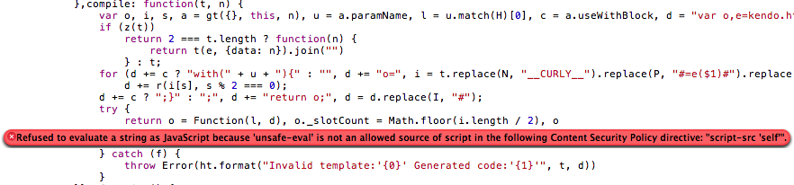

#### Kendo UI のテンプレートエンジンで
#### Function コンストラクタを使ってる所

---
### 教訓
- Firefox OS アプリはとりあえず `"type": "privileged"` にしとく
	- 常に強制 CSP ポリシーを有効化
	- いつ systemXHR 欲しくなるか分からないし、、、
- Corodva なら &lt;meta&gt; で CSP 付けておくといいかも
	- Webkit 系のブラウザで有効
	- Chrome で CSP エラーがコンソールログに出る
```
<meta http-equiv="Content-Security-Policy" content="default-src *; script-src 'self'; object-src 'none'; style-src 'self' 'unsafe-inline'">
```

- 早めに Firefox OS で動作確認

---
### その後どうしたか？
- UI フレームワークは Intel App Framework に移行
	- Firefox OS 対応済のフレームワーク
- Kendo UI の MVVM は Knockout に移行
	- CSP 通すのに [Knockout Secure Binding](https://github.com/brianmhunt/knockout-secure-binding) が必要

---
### ちなみに、

### MVx フレームワークでは Angular が
### ちゃんと CSP 対応してるらしいです

##### (参考) <https://code.google.com/p/mustache-security/>

---
### 思ったこと

- JS ライブラリ沢山あるけど、どれが Firefox OS 向きなの？
- そもそも、みんなどんな *.js 使ってるんだろう？

---
### マーケットプレースのアプリで
## 調べてみました

---
### パッケージ型アプリで
### よく使われている JS

---
<h4>JS in Packaged apps <span>(Total: 2505)</span></h4>

| # | js | count | % | name | type |
|---|----|-------|---|------|------|
|1 | jquery.js | 1231 | 49.1% |  | |
|2 | jquery.mobile.js | 388 | 15.4% |  | UI framework|
|3 | c2runtime.js | 153 | 6.1% | Construct 2 | Game engine|
|4 | c2webappstart.js | 133 | 5.3% | Construct 2 | Game engine|
|5 | receiptverifier.js | 116 | 4.6% |  | |
|6 | require.js | 106 | 4.2% |  | |
|7 | zepto.js | 104 | 4.1% |  | |
|8 | l10n.js | 101 | 4.0% |  | |
|9 | cordova.js | 101 | 4.0% | Cordova | Hybrid|
|10 | inneractive.js | 87 | 3.4% | Inneractive | Ad network|

---
#### JS in Packaged apps (11~20)

| # | js | count | % | name | type |
|---|----|-------|---|------|------|
|11 | bootstrap.js | 87 | 3.4% |  | UI framework|
|12 | hmac-md5.js | 71 | 2.8% | CryptoJS | |
|13 | cordova_plugins.js | 64 | 2.5% | Cordova | Hybrid|
|14 | underscore.js | 60 | 2.3% |  | |
|15 | angular.js | 54 | 2.1% |  | MVx |
|16 | modernizr.js | 47 | 1.8% |  | |
|17 | seekbars.js | 43 | 1.7% | Building Blocks | UI framework|
|18 | action_menu.js | 43 | 1.7% | Building Blocks | UI framework|
|19 | backbone.js | 41 | 1.6% |  | MVx|
|20 | idangerous.swiper.js | 37 | 1.4% | Swiper | UI control|


---
### 特権 (privileged) アプリで
### よく使われている JS

---
#### JS in Privileged apps (Total: 326)

| # | js | count | % | name | type |
|---|----|-------|---|------|------|
|1 | jquery.js | 180 | 55.2% |  | |
|2 | receiptverifier.js | 57 | 17.4% |  | |
|3 | hmac-md5.js | 52 | 15.9% | CryptoJS | |
|4 | jquery.mobile.js | 50 | 15.3% |  | UI framework|
|5 | l10n.js | 36 | 11.0% |  | |
|6 | require.js | 23 | 7.0% |  | |
|7 | zepto.js | 21 | 6.4% |  | |
|8 | cordova.js | 17 | 5.2% | Cordova | Hybrid|
|9 | underscore.js | 16 | 4.9% |  | |
|10 | bootstrap.js | 15 | 4.6% |  | UI framework|

---
#### JS in Privileged apps (11~20)

| # | js | count | % | name | type |
|---|----|-------|---|------|------|
|11 | cordova_plugins.js | 14 | 4.2% | Cordova | Hybrid|
|12 | angular.js | 13 | 3.9% |  | MVx|
|13 | seekbars.js | 13 | 3.9% | Building Blocks | UI framework|
|14 | backbone.js | 13 | 3.9% |  | MVx|
|15 | enyo.js | 12 | 3.6% |  | UI framework|
|16 | async_storage.js | 12 | 3.6% |  | Gaia/Shared|
|17 | action_menu.js | 11 | 3.3% | Building Blocks | UI framework|
|18 | jquery.transit.js | 8 | 2.4% |  | jQuery plugin|
|19 | offline.js | 8 | 2.4% |  | |
|20 | md5.js | 8 | 2.4% | CryptoJS | |

---
## UI Wiget Framework
##### Packaged (Total: 2505)

---
#### UI Wiget Framework

| # | js | count | % | name |
|---|----|-------|---|------|
|1 | jquery.mobile.js | 388 | 15.4% |  |
|2 | bootstrap.js | 87 | 3.4% |  |
|3 | seekbars.js | 43 | 1.7% | Building Blocks |
|4 | action_menu.js | 43 | 1.7% | Building Blocks |
|5 | jquery-ui.js | 33 | 1.3% |  |
|6 | enyo.js | 19 | 0.7% |  |
|7 | lungo.js | 14 | 0.5% |  |
|8 | brick.js | 9 | 0.3% |  |
|9 | appframework.ui.js | 5 | 0.1% | App Framework |
|10 | ionic.js | 4 | 0.1% | Ionic |
|11 | onsenui.js | 2 | 0.0% |  |
|12 | kendo.mobile.js | 2 | 0.0% | &nbsp; |

---
## MVx

---
### MVx

<style>
.reveal .mvx-subtitle {
	margin: 0 0 5px 0;
}
</style>

<h5 class="mvx-subtitle">Packaged (Total: 2505)</h5>

| # | js | count | % |
|---|----|-------|---|
|1 | angular.js | 54 | 2.1% |
|2 | backbone.js | 41 | 1.6% |
|3 | knockout.js | 36 | 1.4% |
|4 | ember.js | 1 | 0.0% |

<h5 class="mvx-subtitle">Privileged (Total: 326)</h5>

| # | js | count | % |
|---|----|-------|---|
|1 | angular.js | 13 | 3.9% |
|2 | backbone.js | 13 | 3.9% |

---
### ご清聴ありがとうございました！


