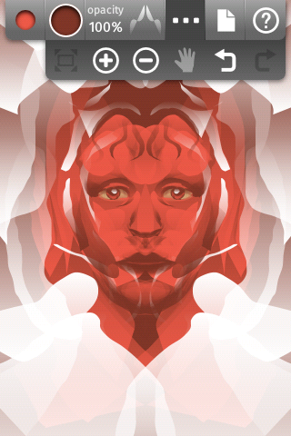
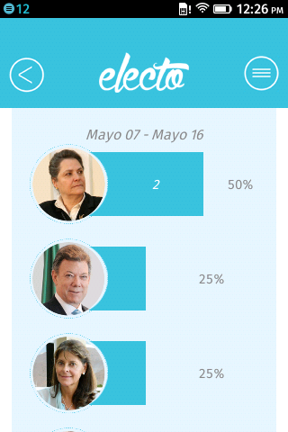

## Firefox Marketplace の
## アプリを色々調べてみた

---
#### 自己紹介
<h2>ひらとり</h2>


<div style="font-size:30px">(@flatbirdH)</div>

- Firefox OS コミュニティ
- html5j Webプラットフォーム部

---
#### 前々回 LT しました

#### 関東 Firefox OS 勉強会 5th
##### (2013/11/26)


##### <http://flatbird.github.io/LT-fxos-marketplace/>

---
### Firefox Marketplace API 紹介


---
#### こんなの作りました、という話


---
## 今回は、
## 続編みたいな感じ

---
## アプリは
## どれだけ増えてる？

---
### 1 年で
## 1,209 個→4,287 個へ


---
## まだまだ少ない？

---
<!-- .element: style="width: 100%" -->

##### <http://weekly.ascii.jp/elem/000/000/217/217854/>

---
### 「Firefox OSデバイス向けのアプリで、マーケットプレイスの中にあるものはそれほど多くない」<!-- .element: class="fragment" data-fragment-index="1" -->
### 「人気があるのは“ホスティッド”で、全体の90％程度」<!-- .element: class="fragment" data-fragment-index="2" -->

---
#### マーケットプレースではパッケージ型が５割強

<!-- .element: style="width:100%" -->

---
### 思いのほか「野良アプリ」が多い？
### 実際のアプリ数は？<!-- .element: class="fragment" -->

---
### ホスト型が 90%
<h3 style="margin-bottom: 30px" class="fragment">
	マーケットのパッケージ型アプリ
	<span class="strong red">2172</span> 個
	<span class="small">(2014/7/1)</span>
</h3>
<h3 style="margin-bottom: 30px" class="fragment">
	これが 10 % なら全体は<span class="strong red">２万以上！</span>
</h3>

---
### Firefox OS アプリは見かけより多い。
### とはいっても、、、<!-- .element: class="fragment" -->

---
### 日本語アプリ少ない！

#### Total: 4273 (2014/06/30)

<!-- .element: id="hoge" -->

<table id="locale-table">
	<thead>
		<tr>
			<th>#</th>
			<th>locale</th>
			<th>count</th>
			<th>%</th>
			<th>#</th>
			<th>locale</th>
			<th>count</th>
			<th>%</th>
		</tr>
	</thead>
	<tbody>
		<tr>
			<td>1</td>
			<td>en-US</td>
			<td>34</td>
			<td>79.06%</td>
			<td>11</td>
			<td>tr</td>
			<td>1</td>
			<td>2.32%</td>
		</tr>
		<tr>
			<td>2</td>
			<td>es</td>
			<td>8</td>
			<td>18.6%</td>
			<td></td>
			<td></td>
			<td></td>
			<td></td>
		</tr>
		<tr>
			<td>3</td>
			<td>pt-BR</td>
			<td>4</td>
			<td>9.3%</td>
			<td></td>
			<td></td>
			<td></td>
			<td></td>
		</tr>
		<tr>
			<td>4</td>
			<td>fr</td>
			<td>3</td>
			<td>6.97%</td>
			<td></td>
			<td></td>
			<td></td>
			<td></td>
		</tr>
		<tr>
			<td>5</td>
			<td>pl</td>
			<td>3</td>
			<td>6.97%</td>
			<td></td>
			<td></td>
			<td></td>
			<td></td>
		</tr>
		<tr>
			<td>6</td>
			<td>de</td>
			<td>2</td>
			<td>4.65%</td>
			<td></td>
			<td></td>
			<td></td>
			<td></td>
		</tr>
		<tr>
			<td>7</td>
			<td>it</td>
			<td>2</td>
			<td>4.65%</td>
			<td></td>
			<td></td>
			<td></td>
			<td></td>
		</tr>
		<tr>
			<td>8</td>
			<td>hu</td>
			<td>2</td>
			<td>4.65%</td>
			<td></td>
			<td></td>
			<td></td>
			<td></td>
		</tr>
		<tr>
			<td>9</td>
			<td>el</td>
			<td>1</td>
			<td>2.32%</td>
			<td></td>
			<td></td>
			<td></td>
			<td></td>
		</tr>
		<tr>
			<td>10</td>
			<td>ru</td>
			<td>1</td>
			<td>2.32%</td>
			<td></td>
			<td></td>
			<td></td>
			<td></td>
		</tr>
	</tbody>
</table>

---

## 誰か、もっと作って！

<ul>
<li class="fragment" data-fragment-index="1"><h3>でも、端末出てないし、、、</h3></li>
<li class="fragment" data-fragment-index="2"><h3>市場シェアが、、、</h3></li>
<li class="fragment" data-fragment-index="3"><h3>アプリ出してもなー</h3></li>
</ul>

---
## そこで・・・


---
### Cordova (PhoneGap)
- 2014年2月、Cordova 3.4 から Firefox OS サポート。
- Android, iPhone さらに Windows Phone も！
 <!-- .element: style="width:80%;" -->

### 大きな市場を一気に狙えるかも。。。<!-- .element: class="fragment" -->

---
### 実は、マーケットプレースには、
<h3 class="fragment">既に <span style="color:red">60 個</span>以上の Cordova アプリが！</h3>

---
## Cordova Firefox OS 
## アプリ紹介

---
### Webchemy

#####<https://marketplace.firefox.com/app/webchemy-1>




##### Firefox OS, Android, Chrome Apps

---
### MoeDict (萌典)

##### <https://marketplace.firefox.com/app/%E8%90%8C%E5%85%B8> 


##### Firefox OS, Android, iOS
#### 「萌」から始まる中国語 (台湾語) 辞典。

---


#### MoeDict のアイコン

---

### electo

##### <https://marketplace.firefox.com/app/electo>




##### Firefox OS, Android, iOS
#### 南米、コロンビアの大統領選アプリ

---
### electo アプリ紹介文より

##### <!-- .element: class="nomargin" -->原文 (スペイン語)


##### <!-- .element: class="nomargin" -->英語


---
## コロンビアの
## ３大メジャースマホは
<h2>Android, iOS, <span style="color:red">Firefox OS</span>！</h2>

---
### 実はパッケージ型アプリの大半は
### Cordova でも大丈夫？

---
#### パッケージ型でも
### 87.2% (2151/2467) は
#### 特権アプリ (privileged) でない

- つまり、Firefox OS 固有の Web API ほとんど使ってない
- Cordova で行けるんじゃ？

---
### Firefox OS アプリを検討する際は、
### Cordova も検討するといいかも

---
### 私もやってみました！

---
### Cordova Firefox OS 体験談

---
### ＜作ったもの＞
### アドレス帳移行アプリのプロトタイプ

---
### スタイルを素で組むの面倒！
- ヘッダとかフッタとかメニューとか、、、
- ネイティブ開発なら何もしなくても付いてくるのに。。。
- スマホアプリっぽい見た目をサクっと用意してほしい。

---
### モバイル UI フレームワークを
### 使おう！

---
## jQuery Mobile,
## Sencha Touch, Kendo UI,<!-- .element: class="fragment" -->
## TopCoat, App Framework,<!-- .element: class="fragment" -->
## Onsen UI, Ionic...<!-- .element: class="fragment" -->
<br>
### どれがいいの？？？<!-- .element: class="fragment" -->

---
### Kendo UI を選ぶ


<!-- .element: class="nomargin" style="width:60%" -->

##### <!-- .element: class="nomargin" --><http://www.telerik.com/kendo-ui>

- 多機能なモバイル UI フレームワーク
- テンプレート、データバインディングも
- ４月からオープンソース化

---
### これが後に不幸を呼ぶ。。。

---
### 大体動く所まで来た・・・
1. ブラウザ (ripple) で開発<!-- .element: class="fragment" -->
2. Android で動作確認<!-- .element: class="fragment" -->
3. iOS で動作確認<!-- .element: class="fragment" -->
4. Firefox OS で動作確認・・・<!-- .element: class="fragment" -->

---
### あれ？
- コンタクトリスト取れない？<!-- .element: class="fragment" -->
- あ、マニフェストに `"type": "privileged"` ついてなかった。<!-- .element: class="fragment" -->
- permission も設定して、Firefox OS で再確認。<!-- .element: class="fragment" -->

---
## 真っ白。。。


---
## 原因は CSP 違反

---
### CSP: Content Security Policy
- クロスサイトスクリプティング対策
- 外部リソースの制限や eval の禁止等
- 特権・認定アプリに強制的に付いてくる

<br>
#### [CSP (Content Security Policy) - Security | MDN](https://developer.mozilla.org/ja/docs/Security/CSP)

---
### 引っかかったのは、この部分


#### テンプレートエンジンで Function コンストラクタを使ってる所

---
## 教訓
- Firefox OS アプリはとりあえず `"type": "privileged"` にしとく
	- 常に強制 CSP を有効化
	- いつ systemXHR 欲しくなるか分からないし、、、
- Corodva なら &lt;meta&gt; で CSP 付けておくといいかも
	- Webkit 系のブラウザで有効
	- Chrome で CSP エラーがコンソールログで分かる

```
<meta http-equiv="Content-Security-Policy" content="default-src *; script-src 'self'; object-src 'none'; style-src 'self' 'unsafe-inline'">
```

---
### その後どうしたか？
- UI フレームワークは Intel App Framework に移行
	- Firefox OS 対応済のフレームワーク
- Kendo UI の MVVM は Knockout に移行
	- CSP 通すのに [Knockout Secure Binding](https://github.com/brianmhunt/knockout-secure-binding) が必要。

---
### ちなみに、

### MVx フレームワークでは Angular が
### ちゃんと CSP 対応してるらしいです

##### (参考) <https://code.google.com/p/mustache-security/>

---
### 思ったこと

- JS ライブラリ沢山あるけど、どれが Firefox OS 向きなの？
- そもそも、みんなどんなの使ってるんだろう？

<br>
### 調べてみよう！<!-- .element: class="fragment" -->

---
#### パッケージ型アプリで
#### よく使われている .js ファイル

#### Total: 2493 (2014/06/30)

| # | js | count | % | name | type | # | js | count | % | name | type |
|---|----|-------|---|------|------|---|----|-------|---|------|------|
|1 | jquery.js | 1224 | 49.0% |  | dom | 11 | bootstrap.js | 87 | 3.4% |  | ui framework|
|2 | jquery.mobile.js | 386 | 15.4% |  | ui framework | 12 | hmac-md5.js | 71 | 2.8% | CryptoJS | utility|
|3 | c2runtime.js | 149 | 5.9% | Construct 2 | game engine | 13 | cordova_plugins.js | 63 | 2.5% | Cordova | hybrid|
|4 | c2webappstart.js | 129 | 5.1% | Construct 2 | game engine | 14 | underscore.js | 60 | 2.4% |  | utility|
|5 | receiptverifier.js | 116 | 4.6% |  | boilerplate | 15 | angular.js | 54 | 2.1% |  | mvx|
|6 | require.js | 105 | 4.2% |  | utility | 16 | modernizr.js | 47 | 1.8% |  | utility|
|7 | zepto.js | 103 | 4.1% |  | dom | 17 | seekbars.js | 43 | 1.7% | Building Blocks | ui framework|
|8 | l10n.js | 100 | 4.0% |  | utility | 18 | action_menu.js | 43 | 1.7% | Building Blocks | ui framework|
|9 | cordova.js | 100 | 4.0% | Cordova | hybrid | 19 | backbone.js | 40 | 1.6% |  | mvx|
|10 | inneractive.js | 87 | 3.4% | inneractive | ad network | 20 | idangerous.swiper.js | 37 | 1.4% | Swiper | ui control|


---
#### 特権 (privileged) アプリで
#### よく使われている .js ファイル

#### Total: 323 (2014/06/30)

| # | js | count | percent | name | type |
|---|----|-------|---------|------|------|
| 1 | jquery.js | 179 | 55.41% | jquery.js | dom |
| 2 | receiptverifier.js | 57 | 17.64% | receiptverifier.js | boilerplate |
| 3 | hmac-md5.js | 52 | 16.09% | CryptoJS | utility |
| 4 | jquery.mobile.js | 49 | 15.17% | jquery.mobile.js | ui framework |
| 5 | l10n.js | 35 | 10.83% | l10n.js | utility |
| 6 | require.js | 22 | 6.81% | require.js | utility |
| 7 | zepto.js | 20 | 6.19% | zepto.js | dom |
| 8 | cordova.js | 16 | 4.95% | Cordova | hybrid |
| 9 | underscore.js | 16 | 4.95% | underscore.js | utility |
| 10 | bootstrap.js | 15 | 4.64% | bootstrap.js | ui framework |
| 11 | cordova_plugins.js | 13 | 4.02% | Cordova | hybrid |
| 12 | angular.js | 13 | 4.02% | angular.js | mvx |
| 13 | seekbars.js | 13 | 4.02% | Building Blocks | ui framework |
| 14 | enyo.js | 12 | 3.71% | enyo.js | ui framework |
| 15 | backbone.js | 12 | 3.71% | backbone.js | mvx |
| 16 | async_storage.js | 12 | 3.71% | async_storage.js | Gaia/Shared |
| 17 | action_menu.js | 11 | 3.4% | Building Blocks | ui framework |
| 18 | jquery.transit.js | 8 | 2.47% | jquery.transit.js | jquery plugin |
| 19 | offline.js | 8 | 2.47% | offline.js | utility |
| 20 | md5.js | 8 | 2.47% | CryptoJS | utility |

---
### ご清聴ありがとうございました！


