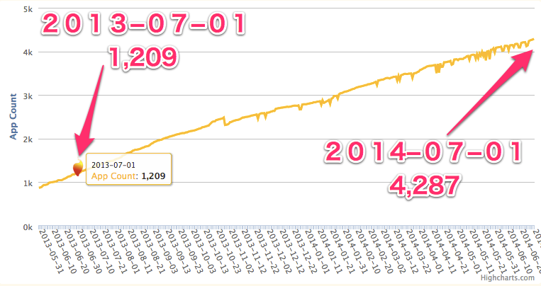
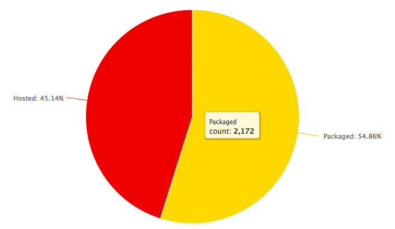

## Firefox Marketplace の
## アプリを色々調べてみた

---
#### 自己紹介
## ひらとり


- html5j Webプラットフォーム部
- Firefox OS コミュニティ

---
### 前々回 LT しました

### 関東 Firefox OS 勉強会 5th
#### 2013/11/26


---
### Firefox Marketplace API 紹介


---
#### こんなの作りました、という話


---
### 今回の話は
### その続編みたいな感じ

---
## アプリはどれだけ増えたか？

---
## 1 年間で
## 1,204 個 → 4,263 個へ


---
## まだまだ少ない？

---


##### <http://www.itmedia.co.jp/mobile/articles/1406/10/news133.html>

---
#### 3.アプリの少なさ</h5>


---
#### 一方で、、、


##### <http://weekly.ascii.jp/elem/000/000/217/217854/>

#### 「Firefox OSデバイス向けのアプリで、マーケットプレイスの中にあるものはそれほど多くない」<!-- .element: class="fragment" data-fragment-index="1" -->
#### 「今現在、人気があるのは“ホスティッド”で、全体の90％程度がこちらになっています。」<!-- .element: class="fragment" data-fragment-index="2" -->


---
### 90% はホスト型！
#### マーケットプレイス外が多い

---
### 本当のアプリ数？

<ul>
	<li>マーケットのパッケージ型アプリ:
		<span class="strong">2157</span> 個
		<span class="small">(2014/6/29)</span>
	</li>
	<li>これが 10 % だとすると、全体は<span class="strong">２万以上！</span> </li>
</ul>



---
### とはいえ、、、

 <!-- .element: style="width:100%;" class="fragment" data-fragment-index="1" -->

<ul>
<li class="fragment" data-fragment-index="2"><h3>そうかも、、、</h3></li>
<li class="fragment" data-fragment-index="3"><h3>Android/iOS と遜色ないアプリもあるけど、探す方が大変。。。</h3></li>
</ul>


---
### 日本語アプリ少ない！

#### Total: 4273 (2014/06/30)

| #  |Locale |Count |Percent |
|----|-------|------|--------|
| 1  | en-US | 3516 | 82.28% |
| 2  | es | 901 | 21.08% |
| 3  | pt-BR | 295 | 6.9% |
| 4  | de | 254 | 5.94% |
| 5  | fr | 229 | 5.35% |
| 6 | pt-PT | 202 | 4.72% |
| 7 | pl | 201 | 4.7% |
| 8 | it | 200 | 4.68% |
| 9 | hu | 101 | 2.36% |
| 10 | ru | 75 | 1.75% |
| 11 | el | 63 | 1.47% |
| 12 | nl | 50 | 1.17% |
| 13 | zh-CN | 42 | 0.98% |
| 14 | ja | 38 | 0.88% |
| 15 | zh-TW | 36 | 0.84% |

---

### もっと作って！

<ul>
<li class="fragment" data-fragment-index="2"><h3>でも、端末出てないし、、、</h3></li>
<li class="fragment" data-fragment-index="3"><h3>市場シェア、、、</h3></li>
</ul>

---
### そこで・・・


---
### Cordova (PhoneGap)
- 2014年2月、Cordova 3.4 から Firefox OS サポート。
- Android, iPhone さらに Windows Phone も！

<br>
 <!-- .element: style="width:80%;" -->


---
### 既に 60 個以上の Cordova アプリが
### マーケットプレースに！

---
### Cordova Firefox OS 
### アプリ紹介

---
### Webchemy

##### <!-- .element: class="link" --><https://marketplace.firefox.com/app/webchemy-1>


##### Firefox OS, Android, Chrome Apps

---
### MoeDict (萌典)

##### <!-- .element: class="link" --><https://marketplace.firefox.com/app/%E8%90%8C%E5%85%B8> 


##### Firefox OS, Android, iOS
- 「萌」から始まる中国語 (台湾語) 辞典。
- オフラインで動く！

---


#### MoeDict のアイコン

---

### electo

##### <!-- .element: class="link" --><https://marketplace.firefox.com/app/electo>


##### Firefox OS, Android, iOS
#### 南米コロンビアの大統領選アプリ

---
### electo アプリ紹介文 (一部)

##### <!-- .element: class="link" -->原文 (スペイン語)


##### <!-- .element: class="link" -->英語


---
### コロンビア３大スマホは
### Android, iOS, Firefox OS！

---
#### 実はパッケージ型アプリの大半は
#### Cordova でも大丈夫では？

- 87.2% (2151/2467) が特権 (privileged) なし
- Firefox OS 固有の Web API ほとんど使ってない


---
### 私もやってみました！


---

### Cordova Firefox OS 体験談


---
### ＜作ったもの＞
### アドレス帳移行アプリのプロトタイプ
- アドレス帳を Firefox OS, Android, iOS 間で移行。
- データの保存は Parse (mBaaS) を使う。

---
### アプリのスタイルを素で組むの面倒
- ヘッダとかフッタとかメニューとか
- ネイティブ開発なら何もしなくても付いてくるのに。。。

---
### UI フレームワークを使おう！

- jQuery Mobile
- Twitter Bootstrap
- Sencha Touch
- Kendo UI Mobile
- Adobe TopCoat
- Intel App Framework
- Onsen UI
- Ionic

### いっぱいあり過ぎて選定つらい、、、

---
### Kendo UI を選んだ

##### <!-- .element: class="link" --><http://www.telerik.com/kendo-ui>


- 多機能な UI Wiget フレームワーク
- テンプレート、データバインディングも
- ４月からオープンソース化

---
### 大体動く所まで来た・・・
1. ブラウザ (ripple) で開発
2. Android で動作確認
3. iOS で動作確認
4. Firefox OS で動作確認・・・


---
### あれ？
- コンタクトリスト取れない？
- あ、マニフェストに `"type": "privileged"` 設定してなかった。
- permission も設定して、Firefox OS で再確認。

---
## 真っ白。。。


---
## 原因は CSP 違反

---
### CSP: Content Security Policy
- クロスサイトスクリプティング対策
- 外部リソースの制限や eval の禁止等
- 特権・認定アプリに強制的に付いてくる

---
### ダメだったのは、この部分


#### テンプレートエンジンで Function コンストラクタを使ってる所

---
### 教訓
- Firefox OS アプリはとりあえず `"type": "privileged"` にしとく
	- 常に強制 CSP を有効化
	- いつ systemXHR 欲しくなるか分からないし、、、
- Corodva なら &lt;meta&gt; で CSP 付けておくといいかも
	- Webkit 系のブラウザで有効
	- Chrome で CSP エラーがコンソールログで分かる

```
<meta http-equiv="Content-Security-Policy" content="default-src *; script-src 'self'; object-src 'none'; style-src 'self' 'unsafe-inline'">
```

---
### その後どうしたか？
- UI フレームワークは Intel App Framework に移行
	- Firefox OS に対応済
- Kendo UI の MVVM 部分は Knockout に移行
	- CSP 通すのに [Knockout Secure Binding](https://github.com/brianmhunt/knockout-secure-binding) が必要。

---
### ちなみに、

- <!-- .element: style="list-style: none" --> <h3>MVx フレームワークでは Angular がちゃんと CSP 対応してるらしいです</h3>

##### (参考) <https://code.google.com/p/mustache-security/>

---
### 思ったこと

- JS ライブラリ沢山あるけど、どれが Firefox OS 向きなの？
- そもそも、みんなどんなの使ってるんだろう？
- 調べてみよう！

---
#### パッケージ型アプリで
#### よく使われている .js ファイル

#### Total: 2493 (2014/06/30)

| # | js | count | percent | name | type |
|---|----|-------|---------|------|------|
| 1 | jquery.js | 1224 | 49.09% | jquery.js | dom |
| 2 | jquery.mobile.js | 386 | 15.48% | jquery.mobile.js | ui framework |
| 3 | c2runtime.js | 149 | 5.97% | Construct 2 | game engine |
| 4 | c2webappstart.js | 129 | 5.17% | Construct 2 | game engine |
| 5 | receiptverifier.js | 116 | 4.65% | receiptverifier.js | boilerplate |
| 6 | require.js | 105 | 4.21% | require.js | utility |
| 7 | zepto.js | 103 | 4.13% | zepto.js | dom |
| 8 | l10n.js | 100 | 4.01% | l10n.js | utility |
| 9 | cordova.js | 100 | 4.01% | Cordova | hybrid |
| 10 | inneractive.js | 87 | 3.48% | inneractive | ad network |
| 11 | bootstrap.js | 87 | 3.48% | bootstrap.js | ui framework |
| 12 | hmac-md5.js | 71 | 2.84% | CryptoJS | utility |
| 13 | cordova_plugins.js | 63 | 2.52% | Cordova | hybrid |
| 14 | underscore.js | 60 | 2.4% | underscore.js | utility |
| 15 | angular.js | 54 | 2.16% | angular.js | mvx |
| 16 | modernizr.js | 47 | 1.88% | modernizr.js | utility |
| 17 | seekbars.js | 43 | 1.72% | Building Blocks | ui framework |
| 18 | action_menu.js | 43 | 1.72% | Building Blocks | ui framework |
| 19 | backbone.js | 40 | 1.6% | backbone.js | mvx |
| 20 | idangerous.swiper.js | 37 | 1.48% | Swiper | ui control |


---
#### 特権 (privileged) アプリで
#### よく使われている .js ファイル

#### Total: 323 (2014/06/30)

| # | js | count | percent | name | type |
|---|----|-------|---------|------|------|
| 1 | jquery.js | 179 | 55.41% | jquery.js | dom |
| 2 | receiptverifier.js | 57 | 17.64% | receiptverifier.js | boilerplate |
| 3 | hmac-md5.js | 52 | 16.09% | CryptoJS | utility |
| 4 | jquery.mobile.js | 49 | 15.17% | jquery.mobile.js | ui framework |
| 5 | l10n.js | 35 | 10.83% | l10n.js | utility |
| 6 | require.js | 22 | 6.81% | require.js | utility |
| 7 | zepto.js | 20 | 6.19% | zepto.js | dom |
| 8 | cordova.js | 16 | 4.95% | Cordova | hybrid |
| 9 | underscore.js | 16 | 4.95% | underscore.js | utility |
| 10 | bootstrap.js | 15 | 4.64% | bootstrap.js | ui framework |
| 11 | cordova_plugins.js | 13 | 4.02% | Cordova | hybrid |
| 12 | angular.js | 13 | 4.02% | angular.js | mvx |
| 13 | seekbars.js | 13 | 4.02% | Building Blocks | ui framework |
| 14 | enyo.js | 12 | 3.71% | enyo.js | ui framework |
| 15 | backbone.js | 12 | 3.71% | backbone.js | mvx |
| 16 | async_storage.js | 12 | 3.71% | async_storage.js | Gaia/Shared |
| 17 | action_menu.js | 11 | 3.4% | Building Blocks | ui framework |
| 18 | jquery.transit.js | 8 | 2.47% | jquery.transit.js | jquery plugin |
| 19 | offline.js | 8 | 2.47% | offline.js | utility |
| 20 | md5.js | 8 | 2.47% | CryptoJS | utility |

---
ご清聴ありがとうございました！


